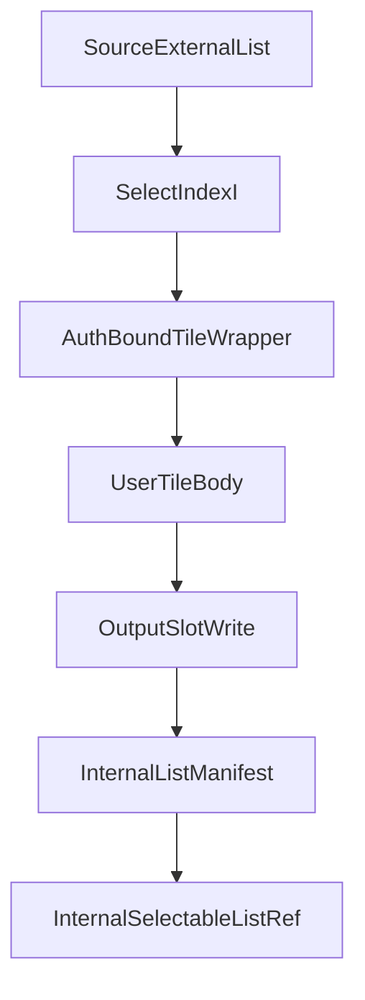

## Recursive List Processing (proposed)

This document proposes a **list-focused recursive execution model** for Raster.
It is intentionally narrower than "general recursive state machines" and is meant
to be the first concrete recursive execution surface:

- input: a committed selectable external list
- execution: one small tile replay per input index
- output: a committed internal selectable list

The main design goal is to let users author ordinary small tiles while Raster
binds each execution to:

- the source list commitment
- the selected input index and inclusion proof
- the destination output collection anchor and slot

without forcing the tile body to receive the whole collection or raw proof
objects.

## Status

This is a **future design proposal**, not implemented behavior.

Relevant current gaps:

- `#[tile(kind = recur)]` is metadata-only today; no recursive executor exists.
- `select!` works for external bindings, but not for internal list references.
- internal storage stores whole objects by coordinates and commitment; it does
  not yet expose selector-aware collection references.

## Code audit tasks (where to look)

- **Current tile argument auth/materialization**
  - `crates/raster-macros/src/lib.rs`
    - `rewrite_into_auth_value_args`
    - `gen_auth_value_materialization`
    - `#[tile]` expansion
- **Current auth binding types**
  - `crates/raster/src/input.rs`
    - `AuthRef`
    - `IntoAuthValue`
    - `auth_ref_trace`
    - `materialize_auth_return`
- **Current selector/list proof types**
  - `crates/raster-core/src/input.rs`
    - `Selectable`
    - `SelectorPath`
    - `SelectionProof`
    - `SelectionProofStep::List`
- **Current external raster selection implementation**
  - `crates/raster-runtime/src/raster_index.rs`
- **Current internal storage model**
  - `crates/raster-runtime/src/internal_storage.rs`
- **Current trace and transition witnesses**
  - `crates/raster-core/src/trace.rs`
  - `crates/raster-core/src/transition.rs`
  - `crates/raster-runtime/src/tracing/recorder.rs`
- **Current replay/proving path**
  - `crates/raster-prover/src/replay.rs`
  - `crates/raster-backend-risc0/src/guest_builder.rs`

## Problem statement

Raster tiles must stay small enough to be replayed inside the zkVM. That rules
out feeding a whole collection into one tile execution just to preserve data
integrity. At the same time, list processing needs each step to be bound to the
committed source list and to a deterministic destination slot in the output
collection.

The proposal therefore separates three layers:

1. **authored tile API**: plain typed arguments, small computation
2. **execution envelope**: auth-bound selected item and output-slot binding
3. **transition verification**: enforces provenance and storage correctness

## Scope

The first version is intentionally constrained:

- only `List<TIn> -> List<TOut>`
- only index-preserving processing
- exactly one output element for each input index
- output length equals input length
- no `filter`, `flat_map`, `reduce`, map keys, or nested collection recursion

This gives the protocol a canonical placement rule:

- input index `i` maps to output index `i`

## High-level model



The user-authored tile sees only the `tileBody` layer. Raster owns:

- selection
- auth materialization
- slot binding
- storage write protocol
- final collection assembly

## User-facing programming model

### Authored tile shape

For the first version, the user writes a normal tile over one item:

```rust
#[tile(kind = recur)]
fn process_item(item: TIn) -> TOut
```

If position matters to the computation, the tile may also accept the index:

```rust
#[tile(kind = recur)]
fn process_item(item: TIn, index: u64) -> TOut
```

The tile body should **not** receive:

- the full input collection
- raw selection proofs
- raw internal-storage witnesses
- a mutable collection object

Those remain in the execution envelope and transition layer.

### Sequence-level use

The sequence-level API should make recursive list processing explicit. A
conceptual surface is:

```rust
#[sequence]
fn main(users: Vec<User>) {
    let scores = call_recur_list!(process_item, users);

    let first_score = select!(Score, scores[0]);
    call!(publish_score, first_score);
}
```

`call_recur_list!` is a placeholder name for the recursive list driver. The
important semantic point is that the driver:

- creates the output list anchor
- enumerates source indices
- builds auth-bound step envelopes
- invokes one small tile execution per index
- returns an `InternalSelectableListRef<TOut>`

## Proposed internal execution contract

Although the user writes:

```rust
#[tile(kind = recur)]
fn process_item(item: TIn, index: u64) -> TOut
```

Raster should execute a hidden auth-bound wrapper, conceptually:

```rust
__raster_recur_auth_process_item(
    item: impl IntoAuthValue<TIn>,
    index: u64,
    slot: OutputSlotBinding<TOut>,
) -> TOut
```

This wrapper is responsible for:

- materializing the selected item into plain `TIn`
- preserving the auth trace for the source item
- preserving destination slot metadata
- calling the user implementation
- emitting the trace/witness data needed by transition verification

This follows the same design direction as the current `#[tile]` macro, which
already accepts auth-bound arguments and materializes them into normal typed
values before entering the user body.

## Why the wrapper should be auth-bound but the tile body should stay plain

The list protocol needs cryptographic binding. Without it, the replayed step
would only prove:

- "some bytes were given to the tile"
- "some output bytes were returned"

That is not enough. The protocol must also prove:

- those bytes were the element at index `i` under source list root `R`
- the returned bytes were written to output slot `i` under anchor `A`

However, that binding does **not** need to be exposed in the authored tile
signature. Keeping the tile body plain has three advantages:

1. user code stays simple and composable
2. zk replay input remains small and typed
3. proof-specific metadata lives in the transition/witness layer where Raster
   already reasons about provenance

## Source list binding

Each step needs a source-side witness that binds the materialized item to the
committed source list.

Conceptually, the execution envelope carries:

- `source_root_commitment`
- `source_len`
- `source_schema_commitment`
- `index`
- `selected_bytes`
- `selection_proof`
- `materialized_value: TIn`

The tile body only sees `materialized_value` and optionally `index`.

The transition layer must verify:

- `selection_proof` authenticates `selected_bytes` against `source_root_commitment`
- the proof corresponds to list index `i`
- the bytes materialized into `TIn` are exactly the bytes replayed into the tile

## Output collection anchor

The output collection should be identified by an explicit anchor, not just by
the source list root alone.

The anchor seed should be derived with domain separation from at least:

- source list root
- tile id
- sequence/run scope
- output length
- output schema commitment

Conceptually:

```text
anchor_seed =
  H(
    "raster.recur.list.output.v1",
    source_root,
    tile_id,
    scope_id,
    output_len,
    output_schema_hash
  )
```

This avoids collisions between multiple derived collections built from the same
source list.

## Output slot binding

Each step also needs a destination-side witness that binds the output bytes to a
single slot in the anchored output list.

Conceptually:

- `output_anchor`
- `output_index`
- `output_len`
- `output_schema_commitment`

For the first version:

- `output_index == input_index`

The tile body does not need a mutable collection object. It returns `TOut`, and
the protocol interprets that return value as the contents of the authorized slot.

## Replay input and replay proof

The zk replay path should remain narrow.

### Replay input bytes

The guest should receive only the normal tile ABI payload:

- `postcard(item)` for `fn(item: TIn) -> TOut`
- `postcard((item, index))` for `fn(item: TIn, index: u64) -> TOut`

The guest should **not** need to deserialize:

- selection proofs
- source roots
- output anchors
- storage witnesses

Those belong to the outer transition proof.

### Replay statement

The replay proof continues to attest:

- "for this plain typed input, tile `process_item` returned these output bytes"

This preserves the existing RISC0 tile replay model.

## Transition proof contract

The transition layer must combine replay with provenance and storage checks.

For each recursive list step, it should verify:

1. the selected input bytes belong to source list root `R` at index `i`
2. the replayed tile input equals those selected bytes
3. the output slot belongs to output anchor `A`
4. the output slot index equals `i`
5. the tile output bytes were committed into slot `(A, i)`
6. slot `(A, i)` was not previously written

Additionally, when the run is finalized, the transition layer should verify:

- all indices `0..len-1` were written exactly once
- the final output root matches the set of per-index writes

## Internal storage model

The internal storage side should remain append-oriented.

Each step writes a small record that binds an output object commitment to a list
slot, conceptually:

```text
InternalCollectionElement {
  collection_id,
  index,
  object_commitment,
}
```

The actual element bytes may still live in the ordinary internal object store,
but the list protocol needs a separate committed record that says:

- this object is the value for output slot `i` of collection `C`

Finalization then assembles an `InternalListManifest` and returns an
`InternalSelectableListRef<TOut>`.

## Relationship to existing `AuthRef` / `AuthValue`

The current auth model is already a strong precedent for this design:

- `IntoAuthValue<T>` lets macro-generated code accept auth-bound values while the
  user body receives plain `T`
- `auth_ref_trace` preserves source metadata for trace/proof layers

The recursive list executor should reuse that pattern instead of inventing a
second user-facing provenance API.

Recommended direction:

- source item binding uses the existing `AuthRef` / `IntoAuthValue` style
- output slot binding is a new internal protocol type, not a user-facing mutable
  handle
- the public tile signature stays plain

## Suggested public API constraints

The first version should support only these recur tile shapes for list
processing:

- `fn(item: TIn) -> TOut`
- `fn(item: TIn, index: u64) -> TOut`

It should not support, in v1:

- user-visible proof objects in the tile signature
- user-visible output slot mutation
- whole-list arguments
- variable-length result emission

If later phases need more context, add a small read-only context argument such
as `RecurListCtx` rather than exposing raw witness objects directly.

## Files likely to change

- `crates/raster-macros/src/lib.rs`
  - generate recur-list auth wrapper behavior
- `crates/raster/src/input.rs`
  - extend auth binding surface as needed
- `crates/raster-core/src/input.rs`
  - add internal selectable list reference types
- `crates/raster-core/src/trace.rs`
  - add source-index and output-slot binding metadata
- `crates/raster-core/src/transition.rs`
  - add witnesses for output-slot writes and final manifest assembly
- `crates/raster-runtime/src/internal_storage.rs`
  - add list-slot write records / manifest support
- `crates/raster-runtime/src/tracing/recorder.rs`
  - record recur-list step metadata
- `crates/raster-prover/src/replay.rs`
  - keep replay narrow; consume plain item or `(item, index)` bytes

## Non-goals for this proposal

This proposal does not define:

- general recursive state machines
- tree reductions or joins
- output collections with different length than the input
- selector-aware arbitrary `InternalRef`
- final on-chain verifier format

Those are follow-up layers. This document is only about the first recursive list
execution surface.

## Recommendation

Implement recursive list processing with **auth-bound execution wrappers and
plain user tile bodies**:

- user writes a normal small recur tile over one item
- Raster binds each execution to the source list commitment and output slot
- replay uses only the plain typed tile input
- transition verification proves provenance and storage correctness
- the final result is an `InternalSelectableListRef<TOut>`

This gives Raster a practical recursive collection model without making zk replay
depend on whole collections or large proof objects.
